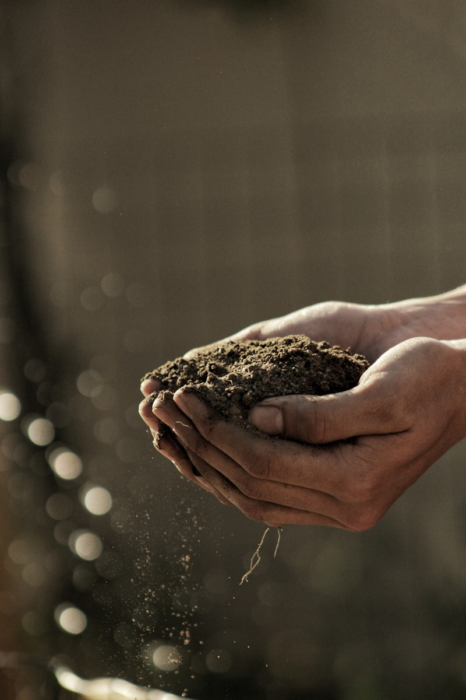
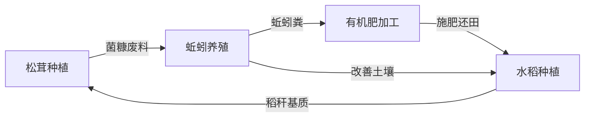

# Claw Farm - 有机循环农业智能决策系统

> 探索 AI Agent 在复杂生态农业系统中的应用

<p align="center">
  
</p>

## 项目简介

本项目是一个**合作探索性项目**，旨在研究智能体（AI Agent）如何辅助复杂生态农业系统的决策与管理。

我们以 **"松茸 - 蚯蚓 - 有机肥 - 稻"** 循环农业模式为核心场景，尝试回答一个问题：

*AI 能否理解并优化一个多物种、多变量、动态耦合的生态农业系统？*

## 循环模式



## 核心探索方向

- **松茸栽培管理** — 基质配方、温湿度与出菇周期的智能调控
- **蚯蚓养殖优化** — 密度、投喂策略与菌糠转化效率
- **有机肥质量控制** — 蚯蚓粪腐熟度、养分配比的分析与预警
- **水稻生长决策** — 从秧苗期到成熟期的施肥与管理
- **循环链路协调** — 四环节间物质流与时序的统筹决策

## 项目结构

```
claw-farm/
├── docs/distilled/    # 经过提炼的核心知识文档
├── assets/sources/    # 原始参考资料（PDF）
├── scripts/           # 数据处理与分析脚本
└── CLAUDE.md          # AI Agent 工作指令
```

## 参与方式

这是一个开放的探索性项目，欢迎对以下方向感兴趣的伙伴参与：

- 生态农业 / 循环农业实践经验
- AI Agent 应用开发
- 农业数据分析与建模

## 致谢

图片来源：[Unsplash](https://unsplash.com)（免费开源图片）
