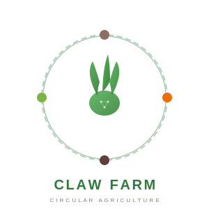
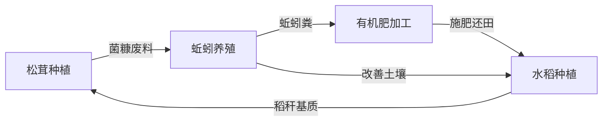
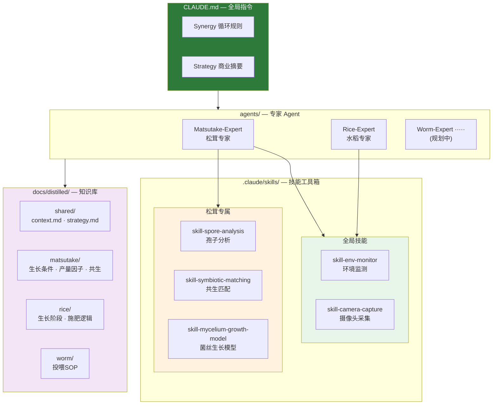

<p align="center">
  <picture>
    <source media="(prefers-color-scheme: dark)" srcset="assets/images/logo-dark.svg" />
    <source media="(prefers-color-scheme: light)" srcset="assets/images/logo-light.svg" />
    
  </picture>
</p>

# Claw Farm - 有机循环农业智能决策系统

> 探索 AI Agent 在复杂生态农业系统中的应用

## 项目简介

本项目是一个**合作探索性项目**，旨在研究智能体（AI Agent）如何辅助复杂生态农业系统的决策与管理。

我们以 **"松茸 - 蚯蚓 - 有机肥 - 稻"** 循环农业模式为核心场景，尝试回答一个问题：

*AI 能否理解并优化一个多物种、多变量、动态耦合的生态农业系统？*

## 循环模式



## 核心探索方向

- **松茸栽培管理** — 基质配方、温湿度与出菇周期的智能调控
- **蚯蚓养殖优化** — 密度、投喂策略与菌糠转化效率
- **有机肥质量控制** — 蚯蚓粪腐熟度、养分配比的分析与预警
- **水稻生长决策** — 从秧苗期到成熟期的施肥与管理
- **循环链路协调** — 四环节间物质流与时序的统筹决策

## 系统架构



## 项目结构

```
claw-farm/
├── CLAUDE.md                        # 全局指令（Synergy规则 + Strategy摘要）
├── agents/
│   └── matsutake-expert/            # 松茸专家 Agent 定义
│       └── AGENT.md
├── .claude/skills/                  # 技能工具箱
│   ├── skill-env-monitor/           #   🌍 全局：环境监测
│   ├── skill-camera-capture/        #   📷 全局：摄像头采集
│   ├── rice-expert/                 #   🌾 水稻专属技能
│   └── matsutake-expert/            #   🍄 松茸专属技能
│       ├── skill-spore-analysis/    #     孢子分析
│       ├── skill-symbiotic-matching/#     共生匹配
│       └── skill-mycelium-growth-model/  菌丝生长模型
├── docs/
│   ├── distilled/                   # 提炼后的知识库
│   │   ├── shared/                  #   项目背景 + 商业逻辑
│   │   ├── matsutake/               #   松茸知识
│   │   ├── rice/                    #   水稻知识
│   │   └── worm/                    #   蚯蚓知识
│   └── products/                    # 产品文档（Web问答PRD等）
├── assets/
│   ├── images/                      # Logo 等图片资源
│   └── sources/                     # 原始 PDF 参考资料
└── scripts/                         # 数据处理与分析脚本
```

## 参与方式

这是一个开放的探索性项目，欢迎对以下方向感兴趣的伙伴参与：

- 生态农业 / 循环农业实践经验
- AI Agent 应用开发
- 农业数据分析与建模

## 致谢

图片来源：[Unsplash](https://unsplash.com)（免费开源图片）
