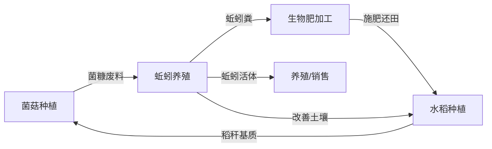
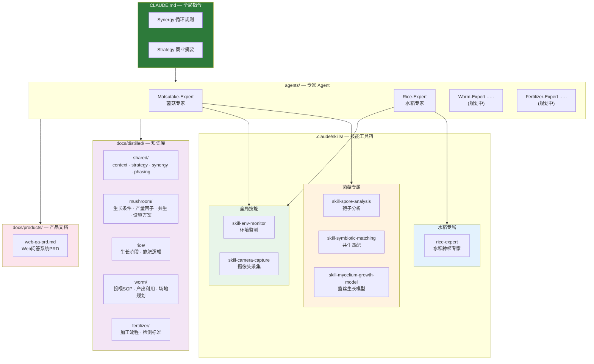

<p align="center">
  <picture>
    <source media="(prefers-color-scheme: dark)" srcset="assets/images/logo-dark.svg" />
    <source media="(prefers-color-scheme: light)" srcset="assets/images/logo-light.svg" />
    
  </picture>
</p>

# Claw Farm - 有机循环农业智能决策系统

> 探索 AI Agent 在复杂生态农业系统中的应用

## 项目简介

本项目是一个**合作探索性项目**，旨在研究智能体（AI Agent）如何辅助复杂生态农业系统的决策与管理。

我们以 **"菌菇 - 蚯蚓 - 生物肥 - 稻"** 循环农业模式为核心场景，尝试回答一个问题：

*AI 能否理解并优化一个多物种、多变量、动态耦合的生态农业系统？*

项目脱胎于梁子湖区梁子镇全域国土综合整治项目，覆盖刘斌村、沙湾村、长岭居委会，总面积约 1065 公顷。

## 循环模式



循环链路遵循三层逻辑：**物质流循环**（废料→原料）、**空间复合利用**（林下种菌/养鸭）、**产出多向输出**（蚯蚓→改土/喂鱼/销售/生物肥）。

## 分期计划

| 阶段 | 时间 | 核心目标 | 状态 |
|------|------|---------|------|
| 第一期 | 2026.4 起 | 水稻启动 + 菌菇试种 + 框架搭建 | 进行中 |
| 第二期 | 待定 | 蚯蚓养殖启动，闭环跑通 | 规划中 |
| 第三期 | 待定 | 规模化 + 外部合作（光伏等） | 远期 |

## 核心探索方向

- **菌菇栽培管理** — 基质配方、温湿度与出菇周期的智能调控（草菇→松茸路线）
- **蚯蚓养殖优化** — 密度、投喂策略与菌糠转化效率
- **生物肥质量控制** — 蚯蚓粪腐熟度、养分配比的分析与预警
- **水稻生长决策** — 从秧苗期到成熟期的施肥与管理
- **循环链路协调** — 四环节间物质流与时序的统筹决策

## 系统架构

<p align="center">
  
</p>



## 项目结构

```
claw-farm/
├── CLAUDE.md                        # 全局指令（Synergy规则 + Strategy摘要）
├── agents/
│   └── matsutake-expert/            # 菌菇专家 Agent 定义
│       └── AGENT.md
├── .claude/
│   ├── commands/                    # 自定义命令
│   │   ├── commit.md                #   智能提交
│   │   ├── pr.md                    #   Pull Request
│   │   ├── optimize.md              #   性能优化
│   │   ├── setup-ci-cd.md           #   CI/CD 配置
│   │   └── ...                      #   doc-refactor / push-all / unit-test-expand 等
│   └── skills/                      # 技能工具箱
│       ├── skill-env-monitor/       #   全局：环境监测
│       ├── skill-camera-capture/    #   全局：摄像头采集
│       ├── rice-expert/             #   水稻专属技能
│       └── matsutake-expert/        #   菌菇专属技能
│           ├── skill-spore-analysis/       孢子分析
│           ├── skill-symbiotic-matching/   共生匹配
│           └── skill-mycelium-growth-model/菌丝生长模型
├── docs/
│   ├── distilled/                   # 提炼后的知识库
│   │   ├── shared/                  #   context（项目背景）· strategy（商业逻辑）
│   │   │                            #   synergy（循环链路）· phasing（分期计划）
│   │   │                            #   exhibition_boards（展板计划）
│   │   ├── mushroom/                #   growth_conditions · yield_factors · symbiosis
│   │   │                            #   facility_plan（设施方案）
│   │   ├── rice/                    #   growth_stages · nutrition_req
│   │   ├── worm/                    #   feeding_sop · products（产出利用）· site_plan
│   │   └── fertilizer/              #   processing（加工流程）· quality（检测标准）
│   ├── products/                    # 产品文档
│   │   └── web-qa-prd.md            #   Web问答系统需求文档
│   └── superpowers/specs/           # 设计文档
│       └── knowledge-base-restructure-design.md
├── assets/
│   ├── images/                      # Logo · 架构图 · 全景规划图
│   └── sources/                     # 原始 PDF 参考资料
└── scripts/                         # 数据处理与分析脚本（规划中）
```

## 参与方式

这是一个开放的探索性项目，欢迎对以下方向感兴趣的伙伴参与：

- 生态农业 / 循环农业实践经验
- AI Agent 应用开发
- 农业数据分析与建模

## 致谢

图片来源：[Unsplash](https://unsplash.com)（免费开源图片）
